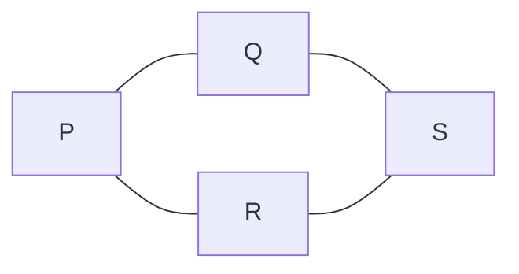

## Introduction
* This paper addresses topology design for LEO constellations: which other satellites each Starlink satellite, with only U = 4 link ports, should connect to via ISLs.
* The authors argue that +Grid (and xGrid / Motif) assume an ideal constellation. Real TLE data shows non-parallel orbits, unequal RAAN and spacing, and perigee differences, so orbital neighbours are not always the best partners. Existing improvements also optimise only the current snapshot, ignoring that satellites move at 7.66 km/s.
* They formulate an optimisation problem that jointly maximises capacity and minimises latency and link churn, and propose the DoTD algorithm to solve it approximately.
    * In each time slot, every satellite scores all satellites that are visible and within range. The score is a weighted sum of the link's normalised capacity, latency and whether the link already existed, plus the other satellite's accumulated historical score.
    * It then connects to the 4 highest-scoring candidates.
* Because orbits are predictable, the topology for the next ten minutes can be precomputed, and OSPF routing runs on top of it.
* In simulations using real orbital data for 907 Starlink satellites, DoTD beats a Greedy baseline (current score only) and +Grid on hop count, latency, capacity and link stability.
* The paper has several flaws, though. All four points below are confirmed against the printed equations (see the Critique section):
    * The latency formula is inverted.
    * The proof that the historical score stays bounded does not hold.
    * The claimed optimality is never proven.
    * The historical score grows without limit and is unrelated to the satellite doing the evaluating.
  These are also the natural places to improve it.

## System Model
* P1: $\max \sum_i \sum_{j\ne i} \phi_{i,j,t}\,(S_{i,j,t} + 1/L_{i,j,t} + \phi_{i,j,t-1})$, subject to:
    * C1 $\sum_j \phi \le U$;
    * C2 links are duplex;
    * C3 the line of sight stays above $\Gamma_{Atmosp} = R_e + 50$ km;
    * C4 $D < D_{Max}$.
* Capacity (Eq. 8): $S = B \log_2(1+\text{SNR})$.
* Latency (Eq. 9) is printed as $L = c/D$, speed over distance, which is inverted. The ground-station delay is printed the same way, $\tau = c/d$.
* GS visibility (Eq. 1): $\theta_{max} = \arccos(R_e\cos\theta_{min}/H) - \theta_{min}$. GS selection (Eq. 5) picks the satellite with the smallest $\tau + 1/C$.
* DTEG: a layered graph of snapshots, $\hat T = T/\tau$ layers and $|V|(\hat T+1)$ nodes, with spatial links only; T ≈ 10 min, τ ≈ 1 s.

## Method (DoTD)
* Normalisation (Eq. 11–12): $\bar S = S/S_{Max}$, $\bar L = L/L_{Max}$, $\bar\phi = \phi/U$, where each max is a running maximum over all feasible links up to t.
* Link score (Eq. 13): $A = w_1\bar S + w_2(1-\bar L) + (1-w_1-w_2)\bar\phi_{t-1}$, with $w_1 = w_2 = 0.4$.
* Total score (Eq. 14): $\alpha_{i,j,t} = A_{i,j,t} + \Pi_{j,t-1}$, with $\Pi_{j,0} = 0$.
* Selection (Eq. 15) is printed as **argmin** over α, while the text says the highest score is chosen; duplex links are set.
* History (Eq. 16): $\Pi_{i,t} = \frac1U\sum_{j\ne i}\phi^*_{i,j,t}(A_{i,j,t}+\Pi_{j,t-1})$.
* Alg. 1, for each t:
    1. TLE → positions.
    2. Compute Γ and D, then S and L.
    3. Update the maxima and normalise.
    4. Compute A and α.
    5. For each pair i, j, link them if both have fewer than U links.
    6. Update Π.
* Routing is OSPF over the resulting topology.
* Complexity: $O(\hat T M^2)$, i.e. $O(M^2)$ for constant $\hat T$.
* Lemma III.1: $g_{Max,t}$ is the achievable maximum up to t (proved by induction and contradiction).
* Lemma III.2: $\Pi_{i,t} < \infty$ as $T\to\infty$ (see the Critique section).

## Evaluation Setup
* Data and tools: CelesTrak TLE from 10 June 2024, 08:23 UTC; MATLAB Aerospace / SatCom toolboxes; xeoverse / Mininet emulator; 907 Starlink satellites.
* Parameters: f = 12.2 GHz, B = 100 MHz, polarisation loss 4.5 dB, misalignment 0.5 dB, G_GS 33.2 dBi, G_LEO 40 dBi, D_Max 7000 km, U = 4.
* Baselines: Greedy (the same Eq. 13, current time only, top 4) and +Grid. xGrid and Motif are not evaluated.
* Ground-station pairs: Sydney–Darwin, Miami–Calgary, New York–Miami, New York–San Francisco, Phnom Penh–Kathmandu.

## Main Results
* New York–San Francisco (Starlink-2658 → 1814): DoTD needs 5 hops, Greedy 6, and +Grid up to 22.
* Hops: on average 10.91% fewer than Greedy, and up to 81.82% fewer than +Grid.
* Latency, Sydney–Darwin: 4.2 ms (DoTD), 9.9 ms (Greedy), up to 203.6 ms (+Grid). The abstract claims −39.71% vs Greedy and up to −96.61% vs +Grid.
* Capacity: on average 28.09% higher than Greedy, and up to 70.47% higher than +Grid.
* Churn, 08:23–11:03: the paper says 3 h 20 min, but that span is actually 2 h 40 min. Unchanged ISL selections were about 5,800 for DoTD, 5,300 for Greedy and a flat 1,250 for +Grid. No percentage is given.

## Critique
* **Latency formula inverted (confirmed)**: Eq. 9 is printed as $L = c/D$ and the GS delay as $\tau = c/d$; latency should be $D/c$. Taken literally, longer links get a smaller L and therefore a larger $(1-\bar L)$ in Eq. 13, so the score would favour long links. That consequence is my inference; the code may implement D/c correctly.
* **Π boundedness proof fails (confirmed)**: the proof unrolls Eq. 17, $\Pi_{i,T} = \frac1U\sum\phi^*A + \frac1{U^2}\sum\sum\phi^*\phi^*A + \dots$. It then argues that A < 1 and $U^T\to\infty$, so Π < ∞. But level k has up to $U^k$ terms, so each level contributes up to about 1 and Π can grow roughly linearly in T. The example below shows this: Π goes 0.7 → 1.36 after one slot.
* **Optimality claim unproven (confirmed)**: the contributions say DoTD "consistently achieves optimal performance", but there is no formal proof; it is a greedy heuristic.
* **Π does not depend on the evaluating satellite**: Eq. 14 adds $\Pi_{j,t-1}$, the candidate's own history, regardless of who i is. Every satellite is therefore drawn toward the same high-Π satellites. Since Π also grows without limit, history eventually dominates A.
* **Other issues**:
    * Eq. 15 is printed as argmin although the text says the highest score is chosen.
    * The churn experiment's duration is misstated.
    * The capacity model is interference-free with fixed power.
    * Links are spatial only.
    * Orbit prediction is assumed accurate.
    * There are only 2 baselines, 907 satellites, 5 GS pairs and one date.
* Future work stated by the authors: hierarchical routing, OSPF weights, GS placement, CDNs.

## 與其他筆記的關聯
* [[LAMP_Low-Latency_Dynamic_Topology_for_LEO_Satellite_Constellations]] 同為動態拓樸，但只動第 4 條鏈路並建模 slew 成本；DoTD 完全沒考慮 slew 時間。
* [[Minimum-hop Constellation Design for LEO Satellite Networks]] 給出對稱 / 非對稱拓樸的 ASPL 下界，可用來判斷 DoTD 的 hop 數離理論極限多遠。
* DoTD 減少拓樸換線；[[StableRoute_When_Dijkstras_Algorithm_Meets_Topology-Varying_Satellite_Networks]] 與 [[Stable_Hierarchical_Routing_for_Operational_LEO_Networks]] 則在路由層減少更新，兩者可以疊加。
***
# DoTD 演算法範例

> 論文：Time-Dependent Network Topology Optimization for LEO Satellite Constellations（INFOCOM 2025）
> 以下數字是為了說明而自行設定的，不是論文的實驗數據。

## 設定

- 4 顆衛星：P、Q、R、S
- 每顆衛星有 2 個埠，$U = 2$（真實情況是 4）
- 紐約的地面站在 P 下方，舊金山的地面站在 S 下方
- 權重：容量 $w_1 = 0.4$、延遲 $w_2 = 0.4$、沿用舊鏈路 $0.2$

## 用到的公式

鏈路分數：

$$A_{i,j,t} = w_1 \bar{S}_{i,j,t} + w_2 (1 - \bar{L}_{i,j,t}) + (1 - w_1 - w_2)\,\bar{\phi}_{i,j,t-1}$$

總分（鏈路分數加上對方的歷史分數）：

$$\alpha_{i,j,t} = A_{i,j,t} + \Pi_{j,t-1}$$

歷史分數更新：

$$\Pi_{i,t} = \frac{1}{U} \sum_{j} \phi^*_{i,j,t} \left( A_{i,j,t} + \Pi_{j,t-1} \right)$$

其中 $\bar{\phi} = \phi / U$，所以沿用舊鏈路的獎勵是 $0.2 \times \frac{1}{2} = 0.10$。

## 時槽 1

### 步驟 1：篩選

4 顆衛星共有 6 種配對。P 和 S 相距 8000 km，超過上限 7000 km，刪除。剩下 5 對。

### 步驟 2：打分數

第一個時槽沒有歷史分數，也沒有舊鏈路，所以 $\alpha = A$，只看容量和延遲。

| 配對 | P–Q | P–R | Q–R | Q–S | R–S |
|------|------|------|------|------|------|
| $A$  | 0.80 | 0.60 | 0.50 | 0.70 | 0.65 |

### 步驟 3：輪流選

| 衛星 | 已有的鏈路 | 可選的對象 | 選擇 |
|------|-----------|-----------|------|
| P | 無 | Q (0.80)、R (0.60) | Q、R |
| Q | P | R (0.50)、S (0.70) | S |
| R | P | S (0.65)，Q 已滿 | S |
| S | Q、R | 已滿 | 無 |

### 結果

Q–R 沒有被選上。

### 步驟 4：更新歷史分數

每顆衛星的 $\Pi$ 是自己兩條鏈路分數的平均。

| 衛星 | 計算 | $\Pi$ |
|------|------|-------|
| P | (0.80 + 0.60) / 2 | 0.700 |
| Q | (0.80 + 0.70) / 2 | 0.750 |
| R | (0.60 + 0.65) / 2 | 0.625 |
| S | (0.70 + 0.65) / 2 | 0.675 |

## 時槽 2

衛星移動了。Q 和 R 互相靠近，其他配對稍微變遠。P–S 仍然超出範圍。

### 鏈路分數

| 配對 | 容量加延遲 | 沿用獎勵 | $A$ |
|------|-----------|---------|------|
| P–Q | 0.60 | +0.10 | 0.70 |
| P–R | 0.55 | +0.10 | 0.65 |
| Q–R | 0.75 | 0 | 0.75 |
| Q–S | 0.62 | +0.10 | 0.72 |
| R–S | 0.60 | +0.10 | 0.70 |

### P 選

| 候選 | $A$ | 對方的 $\Pi$ | $\alpha$ |
|------|------|-------------|----------|
| Q | 0.70 | 0.750 | 1.450 |
| R | 0.65 | 0.625 | 1.275 |

P 有兩個埠，兩個都選。

### Q 選（關鍵的一步）

Q 已經有 P，剩一個埠。

| 候選 | $A$ | 對方的 $\Pi$ | $\alpha$ |
|------|------|-------------|----------|
| R | 0.75 | 0.625 | 1.375 |
| S | 0.72 | 0.675 | **1.395** |

- **DoTD** 看 $\alpha$：選 S，拓樸不變
- **Greedy** 只看 $A$：R 的 0.75 高於 S 的 0.72，改連 R

### R 選

R 已經有 P，剩一個埠，Q 已滿，選 S（$\alpha = 0.70 + 0.675 = 1.375$）。

### DoTD 的結果

拓樸與時槽 1 相同，沒有任何換線。

| 衛星 | 計算 | 新的 $\Pi$ |
|------|------|-----------|
| P | (1.450 + 1.275) / 2 | 1.3625 |
| Q | (0.70 + 0.700 + 0.72 + 0.675) / 2 | 1.3975 |
| R | (0.65 + 0.700 + 0.70 + 0.675) / 2 | 1.3625 |
| S | (0.72 + 0.750 + 0.70 + 0.625) / 2 | 1.3975 |

### Greedy 的結果

Q 改連 R 之後，R 的兩個埠被 P 和 Q 佔滿，Q 也滿了，S 沒有任何衛星可以連，紐約到舊金山的路徑中斷。這是小例子才會這麼極端，但說明了只看當下分數可能破壞整體連通性。

## 預先計算

衛星軌道可以預測，所以上面的流程不需要等時間到了才執行。系統一開始就把未來十分鐘內每個時槽的結果算好，排成一張連線時間表。

## OSPF 找路徑

紐約要傳資料到舊金山，也就是從 P 到 S。在 DoTD 建立的拓樸上有兩條路：

| 路徑 | 延遲 |
|------|------|
| P → Q → S | 5 ms + 6 ms = **11 ms** |
| P → R → S | 7 ms + 6 ms = 13 ms |

OSPF 選擇延遲較低的 P → Q → S。

## 流程總結

1. 由 TLE 計算所有衛星的位置
2. 篩掉視線被擋或距離過遠的配對
3. 計算鏈路分數 $A$（容量、延遲、沿用獎勵）
4. 加上對方的歷史分數，得到 $\alpha$
5. 每顆衛星選 $\alpha$ 最高且雙方都有空埠的對象
6. 更新歷史分數 $\Pi$，進入下一個時槽
7. 全部時槽排定後，OSPF 在當下的拓樸上找最短路徑